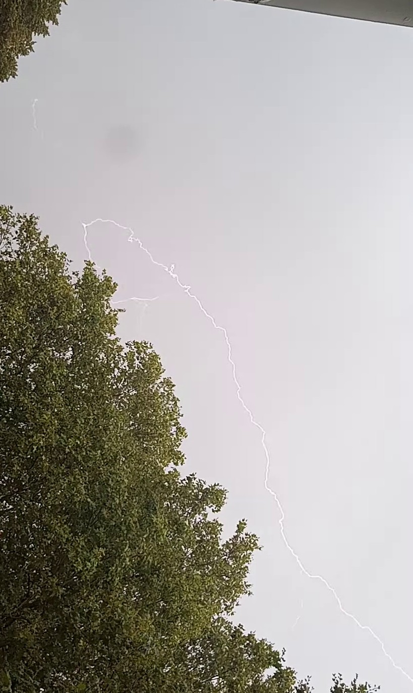

# lightning_detector

Detects lightning from video files, and saves frames that contain the lightning.

With the write video you can capture images like these:




The `ffmpeg_avicon` script will attempt to convert your video into something the python script can work with.

You will have to install ffmpeg, and the ffmpeg script assumes linux/*nix _or use the docker image in this repository_.

It captures at and after a change in mean brightness greater than the threshold value.

That threshold value might change in different conditions, I've found between 2 and 5 (percent) work OK for a cloudy London thunderstorm.

Convert your MP4 file to AVI format:

```bash
chmod a+x ffmpeg_avicon
./ffmpeg_avicon VID_20230826_1234.mp4
```

That will produce a file named ``.avi``

How to use the capture script: 

```bash
# To run the code:
python lightning.py --threshold 3 VID_20230826_1234.mp4.avi

# To see options:
python lightning.py -h

```
